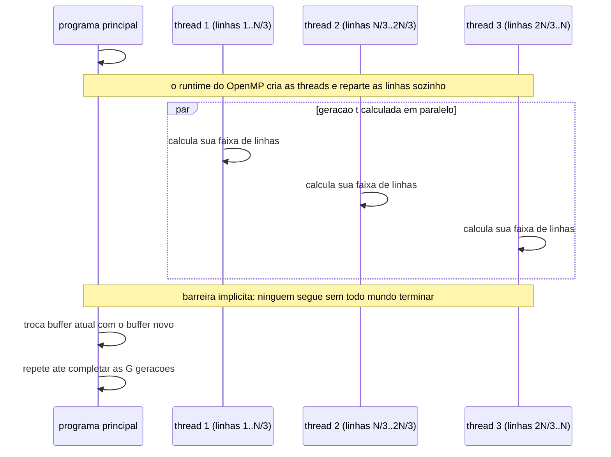
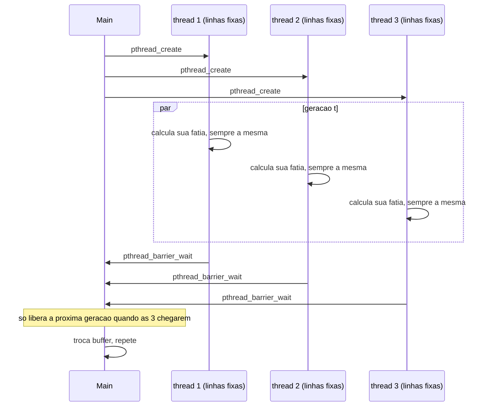
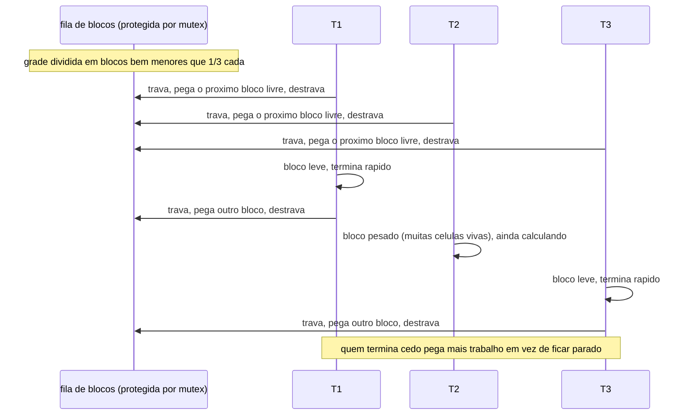
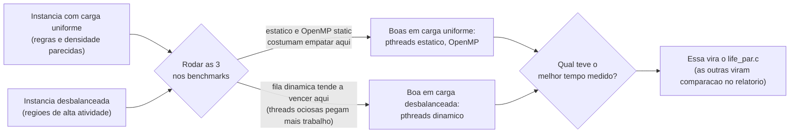

# Plano de Projeto — T1 (INE 5645)

Escopo, requisitos e divisão de trabalho pras 3 semanas. Três escopos possíveis pra
estratégia de paralelização, com vantagens e desvantagens. O grupo escolhe um no kickoff.

## 1. Escopo

**Objetivo:** versão paralela em C do autômato celular do enunciado, comparada com
`life.c`, com relatório da estratégia.

**Dentro:** ler/escrever no formato do enunciado; regras B/S por posição; paralelizar com
threads em memória compartilhada; funcionar em instâncias irregulares; medir speedup;
empacotar a entrega (código, Makefile, README, scripts, relatório SBC).

**Fora:** paralelismo distribuído (MPI); grade toroidal; interface gráfica; alterar
`life.c`, `run.sh` ou `life-*.in`/`.out`.

## 2. Requisitos

| ID | Funcional |
|---|---|
| RF01 | Ler `L C G` da entrada |
| RF02 | Ler `R` regras `B<dígitos>/S<dígitos>` |
| RF03 | Ler matriz `L×C` de regra por posição |
| RF04 | Ler estado inicial (`x`/espaço) |
| RF05 | Geração `t+1` só com estado de `t` (síncrono) |
| RF06 | Até 8 vizinhos, sem toroidal |
| RF07 | Regra da posição, não regra global |
| RF08 | Repetir por `G` gerações |
| RF09 | Imprimir grade final no formato de entrada |

| ID | Não funcional |
|---|---|
| RNF01 | Reduzir tempo frente a `life.c` com múltiplos núcleos |
| RNF02 | Manter desempenho em instâncias desbalanceadas |
| RNF03 | Corretude geral, sem depender só dos 4 casos dados |
| RNF04 | Compilar com `make`, rodar no Santos Dumont |
| RNF05 | Código modular, qualquer integrante explica |

**Restrições:** C, grupo de até 3, todos defendem a solução, entrega via Moodle com
relatório SBC, prazo de 3 semanas.

## 3. Arquitetura

Ver `README.md`. `life.c`/`run.sh`/`life-*.in`/`.out` intocados na raiz; código do grupo em
`src/` + `include/`; docs em `docs/`; binários em `build/` (git-ignorado).

## 4. Escopos possíveis (módulo de decisão)

Três formas de encarar a paralelização, do mais simples ao mais completo. Comparativo
primeiro, detalhe de cada um depois.

| Escopo | Esforço | Risco | Potencial de speedup | Ganho de aprendizado |
|---|---|---|---|---|
| 1. OpenMP só | Baixo | Baixo | Médio | Menor controle manual de threads |
| 2. Pthreads completo | Médio | Médio | Médio-alto | Alto, sincronização toda na mão |
| 3. Comparativo (3 estratégias) | Alto | Alto | Alto (usa a melhor das três) | Alto, mas espalhado entre 3 abordagens |

### Escopo 1: OpenMP só

Uma única implementação, usando `#pragma omp parallel for` e ajuste de `schedule`. Todos
mexem no mesmo arquivo, em etapas.

Vantagens: mais rápido de deixar correto, o compilador cuida da criação de threads e boa
parte da sincronização, menos superfície pra bugs de concorrência.
Desvantagens: menos controle fino sobre o balanceamento de carga; se o resultado não
render um bom speedup, não sobra uma alternativa pronta pra comparar.

O diagrama abaixo não é o cronograma (isso já está nas seções 5 e 6). É o mecanismo em si,
como o OpenMP reparte o trabalho numa geração:



O que aprender olhando isso: o programador não escreve a barreira nem cria a thread à mão,
é isso que "menos controle, menos risco de bug" quer dizer na tabela.

### Escopo 2: Pthreads completo (estático + dinâmico)

Uma única stack, mas construída na mão: primeiro partição estática com barreira entre
gerações, depois fila de trabalho dinâmica (mutex) por cima, pro balanceamento de carga.

Vantagens: controle total sobre a distribuição de trabalho, é o que dá mais espaço pra
otimizar em instâncias bem desbalanceadas, mostra domínio profundo de sincronização (forte
na defesa).
Desvantagens: mais fácil de errar (condição de corrida, deadlock), mais tempo gasto
depurando em vez de otimizando.

Dois mecanismos, na ordem em que são construídos. Primeiro a partição fixa:



Depois, o que muda quando se troca a fatia fixa por uma fila compartilhada (o ganho de
aprendizado da tabela: por que isso ajuda em instância desbalanceada):



### Escopo 3: Comparativo (três estratégias)

Cada pessoa implementa uma versão diferente, em arquivos separados. No fim, o grupo
compara benchmarks e escolhe qual vira a entrega (ou mantém mais de uma para discutir).

Vantagens: mais material real de comparação pro relatório, reduz o risco de apostar tudo
numa estratégia que não performa bem, o ranking de speedup pode usar a melhor das três.
Desvantagens: mais código pra manter e testar ao mesmo tempo, exige mais coordenação
entre os três pra não perder tempo em retrabalho.

Este diagrama já é o de decisão em si: mostra em que tipo de instância cada mecanismo dos
escopos 1 e 2 tende a se sair melhor, que é o critério real pra escolher qual vira a
entrega.



## 5. Cronograma (3 sprints de 1 semana)

DoD: compila sem warnings, passa nos 4 testes, sem erro de memória, qualquer integrante
explica em voz alta.

- **Sprint 1 (corretude):** monta o escopo escolhido (uma versão nos escopos 1 e 2, três
  no escopo 3), batendo com os `.out`.
- **Sprint 2 (desempenho):** ajusta balanceamento de carga; no escopo 3, compara e escolhe
  a versão final.
- **Sprint 3 (entrega):** relatório SBC, ajustes finais, ensaio de defesa em grupo.

## 6. Sugestão de conversas

1. **Kickoff:** escolher o escopo (1, 2 ou 3) usando a tabela da seção 4; fechar structs e
   assinaturas de função.
2. **Checkpoint:** mostrar o que está rodando; resolver o que não bate.
3. **Escolha** (só no escopo 3): comparar benchmarks e decidir a versão final.
4. **Pré-defesa:** todos explicam a versão final de cabeça, mesmo a parte que não escreveram.

## 7. Mapeamento de arquivos

```
Escopo 1:  src/parallel.c (todos, por etapas) · src/grid.c, io.c · gerador.c, timing.c
Escopo 2:  src/parallel_static.c · src/parallel_dynamic.c · src/grid.c, io.c
           gerador.c, timing.c
Escopo 3:  src/parallel_static.c (P1) · parallel_openmp.c (P2) · parallel_dynamic.c (P3)
           src/grid.c, io.c (P1) · gerador.c, timing.c (P3)
main.c: feito junto no kickoff, monta a versão final.
```
